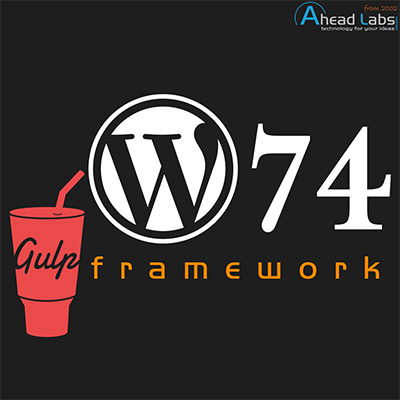

# gulp-w74framework
[](https://github.com/aheadlabs/gulp-w74framework/commits/)
[](https://github.com/aheadlabs/gulp-w74framework/tags)
[](https://github.com/aheadlabs/gulp-w74framework)
[](https://github.com/aheadlabs/gulp-w74framework)
[](https://github.com/aheadlabs/gulp-w74framework/blob/master/LICENSE)  

This package provides Gulp support for the W74 WordPress framework. It is [listed in the npm package directory](https://www.npmjs.com/package/@aheadlabs/gulp-w74framework).  
Everything than can be automated, must be automated!<br><br>


## What is W74 framework?
It is a WordPress framework (parent theme) that lets you develop child themes based on it, taking advantage of its great features:
- High performance (top scores on [benchmarks and tools](https://developers.google.com/web/fundamentals/performance/speed-tools/#what_are_the_different_performance_tools)).
- SEO ready that includes many [JSON-LD](https://json-ld.org/) data formats integrated in post types.
- DevOps ready based on open-sourced [DevOps toolset](https://github.com/aheadlabs/devops-toolset).
- [Google Analytics](https://analytics.google.com/) and [Hotjar](https://www.hotjar.com/) integration.
- Self-developed plugins that do the work.
- Clean and only needed code. No extra weight.

## What does this Gulp plugin do?
Automates the workflow of your theme's development, based on our W74 framework, our way.
- PHP files copy.
- Images compression and copy.
- SCSS transpiling. CSS compression, string replacement, autoprefixing, concatenation and copy.
- JavaScript compression, debug code stripping, concatenation and copy.
- Supports watching and browser synchronization using [BrowserSync](https://browsersync.io/)'s proxy.
- Version number managed from the WordPress database as the single source of truth.

It supports working with your own theme repository. You don't need to develop your theme on top of an existing WordPress installation. BrowserSync has been set up accordingly.

## How to use
In your child theme, just:
- [add gulp as a dev dependency](https://gulpjs.com/docs/en/getting-started/quick-start#install-the-gulp-package-in-your-devdependencies)
- Require this package in your gulpfile.js file. Demo [here](gulpfile-demo.js).
- Call the ``build`` or ``watch`` tasks passing the following parameters in strict order:
```
gulp build --theme-slug="<theme slug>" --wordpress-path="<directory path>"
gulp watch --theme-slug="<theme slug>" --dev-proxy="<local web server>" --wordpress-path="<directory path>"
```

You can also install the package from the npm package directory and set it up your way using the following command:
```
npm install @aheadlabs/gulp-w74framework
```
In addition, you can add it as a dependency
```
npm install @aheadlabs/gulp-w74framework --save
```
or as a dev dependency
```
npm install @aheadlabs/gulp-w74framework --save-dev
```
